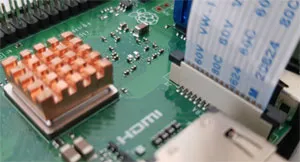

# Comment installer une Caméra sur Raspberry Pi

&nbsp;
***
&nbsp;

##  Mis à jour du Système

* Système mis à jour avec la dernière version de tous les paquets avec ces deux commandes:

```bash
sudo apt update
sudo apt upgrade
```
Une fois que tout va bien, vous pouvez éteindre le Raspberry Pi pour connecter la caméra

```bash
sudo shutdown -h now
```

&nbsp;
***
&nbsp;

##  Connecter la caméra au Raspberry Pi

L’installation de la caméra sur le Raspberry Pi est simple une fois que vous avez trouvé l’emplacement du port :
* Débranchez le Raspberry Pi et sortez-le de son boitier si nécessaire
* **Trouvez le port caméra sur le Raspberry Pi** (entre le port HDMI et la sortie audio).
C’est de toute façon le seul ou vous pourrez brancher le câble, et il est écrit “CAMERA” sur la carte, vous devriez le trouver facilement.
* Avant de brancher la caméra, vous devrez peut-être retirer le film plastique et ouvrir le plastique noir qui se trouve sur le port.
* **Branchez le câble et poussez maintenant le plastique noir pour maintenir le câble en place**.
* Attention à bien respecter le sens du câble (les connecteurs du côté du port HDMI)

*
* Démarrez le Raspberry Pi

&nbsp;
***
&nbsp;

##  Activer le port caméra sur Raspberry Pi OS

Avant d’utiliser votre caméra, il va falloir l’activer sur Raspberry Pi OS.
En effet, le port est désactivé par défaut :
* **Démarrez l’outil raspi-config** :
```bash
sudo raspi-config
```
* Rendez-vous dans “Interface options” > “Legacy Camera”


* “Would you like to rnable legacy camera support?”
Yes!
* Quittez raspi-config et redémarrez le Raspberry Pi

**Après le redémarrage, la caméra est prête à être utilisée**.

* Tappez la commande suivant :

```bash
sudo nano /boot/config.txt
```

* Ajoutez au début du fichier :
```bash
camera_auto_detect=1
```
* Enregistrez , quittez le fichier et redémmarez la carte

```bash
sudo reboot
```

**Après le redémarrage , testez la caméra par la commande : **

```bash
libcamera-still -o image.jpg -n 
```

&nbsp;
***
&nbsp;
