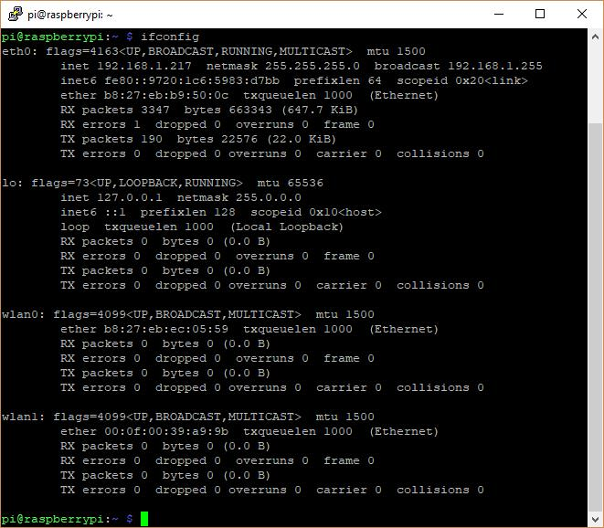
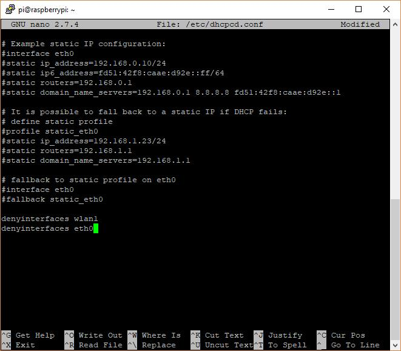
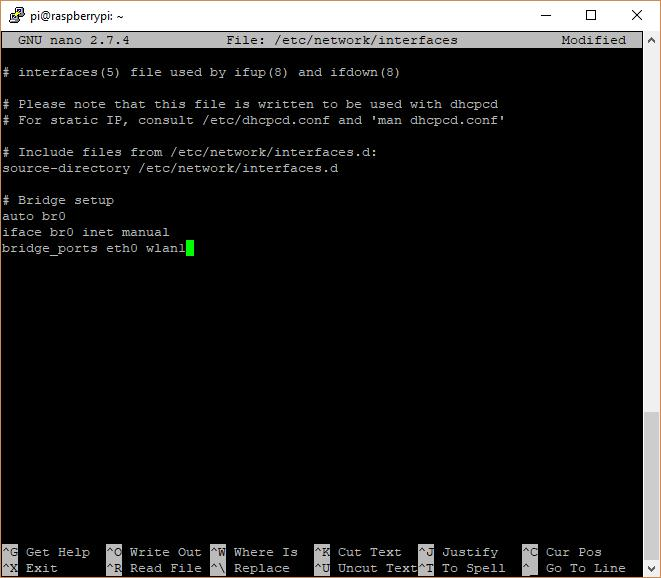
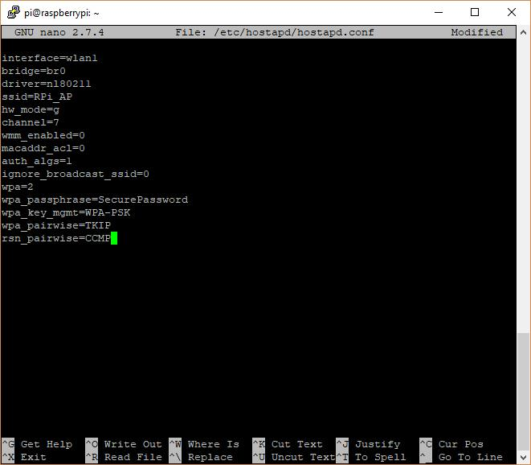
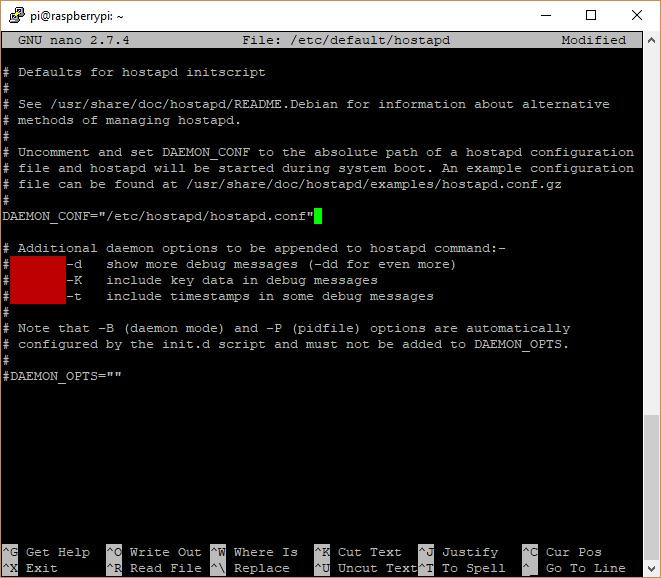
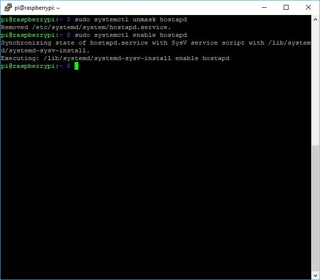

# Configuration d’un point d’accès sans fil

&nbsp;
***
&nbsp;

_Dans ce didacticiel, nous vous montrerons comment configurer votre Raspberry Pi en tant que point d’accès WiFi et comment relier le point d’accès à votre connexion Internet filaire. Si vous cherchez à connecter votre point d’accès à Internet via une connexion wifi, consultez ce tutoriel ici._
&nbsp;


_Commençons par nous assurer que notre installation Raspbian est entièrement à jour_

```bash
sudo apt-get update
sudo apt-get upgrade
```

&nbsp;

_Ensuite, nous pouvons installer le logiciel requis pour ce tutoriel, hostapd et bridge-utils_

&nbsp;
```bash
sudo apt-get install hostapd bridge-utils
```

&nbsp;

_nsuite, nous devons empêcher notre interface Ethernet et notre interface WiFi de se voir attribuer une adresse IP. En effet, le pont agira comme une interface réseau qui a sa propre adresse IP et gérera les connexions via Ethernet et WiFi.

Vous devrez connaître le nom de ces interfaces, en tapant la commande suivante:_
&nbsp;
```bash
ifconfig
```
&nbsp;
_Vous devriez voir une liste des interfaces réseau. Votre connexion filaire sera probablement eth0 et votre connexion sans fil sera probablement wlan0. Si vous utilisez un Pi qui a intégré le WiFi, mais que vous souhaitez utiliser un dongle WiFi USB, pour une meilleure portée ou performance, vous devriez le voir également, et il s’appellera probablement wlan1. Vous pouvez voir dans notre exemple que nous avons deux interfaces WiFi. Nous allons utiliser wlan1, qui est notre dongle Wi-Fi ultra longue portée à gain élevé._


&nbsp;


&nbsp;
_Maintenant que nous connaissons les noms de nos interfaces, eth0 et wlan1, nous pouvons éditer le fichier de configuration dhcpd:_
&nbsp;
```bash
sudo nano /etc/dhcpcd.conf
```
&nbsp;
_et ajoutez les lignes suivantes au bas du fichier (si d’autres interfaces réseau sont définies dans ce fichier, assurez-vous que les lignes suivantes sont placées AVANT leurs définitions.)_

&nbsp;
```bash
denyinterfaces wlan1
denyinterfaces eth0
```
&nbsp;

&nbsp;

_Maintenant, nous pouvons créer le pont_
&nbsp;
```bash
sudo brctl addbr br0
```

&nbsp;
_Une fois le pont créé, nous pouvons alors y connecter notre connexion Ethernet filaire, eth0:_
&nbsp;
```bash
sudo brctl addif br0 eth0
```
&nbsp;
_Maintenant, nous devons modifier notre fichier d’interfaces réseau:_
&nbsp;
```bash
sudo nano /etc/network/interfaces
```
&nbsp;
_et ajoutez les informations de pontage:_
&nbsp;
```bash
# Bridge setup
auto br0
iface br0 inet manual
bridge_ports eth0 wlan1
```
&nbsp;


&nbsp;

_Le pont étant entièrement configuré, il est temps de configurer notre interface WiFi en tant que point d’accès.

Commencez par éditer le fichier de configuration hostapd:_
&nbsp;
```bash
sudo nano /etc/hostapd/hostapd.conf
```
&nbsp;
_et le bloc suivant:_
&nbsp;
```bash
interface=wlan1
bridge=br0
driver=nl80211
ssid=RPi_AP
hw_mode=g
channel=7
wmm_enabled=0
macaddr_acl=0
auth_algs=1
ignore_broadcast_ssid=0
wpa=2
wpa_passphrase=SecurePassword
wpa_key_mgmt=WPA-PSK
wpa_pairwise=TKIP
rsn_pairwise=CCMP
```


&nbsp;

_Modifiez les lignes suivantes selon vos besoins:

ssid = – Il s’agit du nom du réseau que vous voyez lorsque vous recherchez des réseaux WiFi

wpa_passphrase = – Il s’agit du mot de passe requis pour se connecter au réseau WiFi (veuillez noter que les guillemets ne doivent PAS être utilisés autour du mot de passe et doivent comporter plus de 8 caractères, mais moins de 64)_


&nbsp;

 
 

&nbsp;

_Une fois que vous avez ajouté cette configuration, nous devons dire à hostapd de l’utiliser par défaut. Pour ce faire, nous devons modifier le fichier par défaut de hostapd:_
&nbsp;
```bash
sudo nano /etc/default/hostapd
```
&nbsp;
_Mettez à jour la ligne #DAEMON_CONF pour:_
&nbsp;
```bash
DAEMON_CONF="/etc/hostapd/hostapd.conf"
```
&nbsp;
_Notez que le # a été supprimé!_
&nbsp;


 
&nbsp;
_La dernière étape consiste à configurer hostapd pour qu’il démarre au démarrage:_

&nbsp;
```bash
sudo systemctl unmask hostapd
sudo systemctl enable hostapd
```
&nbsp;

 

&nbsp;

_Et c’est tout! Redémarrez votre Raspberry Pi et vous devriez alors être en mesure de voir un réseau appelé «RPP_AP» (ou tout ce que vous l’avez changé) et vous y connecter avec le mot de passe que vous avez utilisé dans le fichier de configuration._


&nbsp;
***
&nbsp;


