# Comment installer Raspberry Pi OS  très simplement avec Raspberry Pi Imager

&nbsp;
***
&nbsp;

_La **Fondation Raspberry Pi** améliore régulièrement le matériel des **Raspberry Pi**, mais elle travaille aussi sur les logiciels. Tout récemment une version améliorée de **Raspberry Pi Imager** est sortie (la 1.7.1) accompagnée d’une première version de **Raspberry Pi OS en 64 bits**. C’est l’occasion de revenir sur l’installeur de système polyvalent qu’est Raspberry Pi Imager._
&nbsp;

&nbsp;
{:.center}
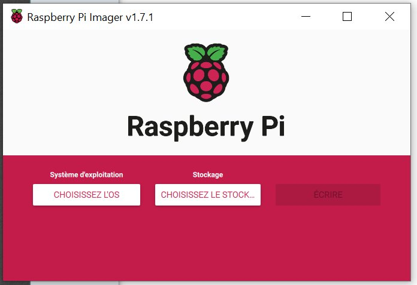

&nbsp;
***
&nbsp;

## Installation de Raspberry Pi Imager

_Vous pouvez  rendre directement sur le site de la Fondation en [cliquant sur ce lien](https://www.raspberrypi.com/software/)._

&nbsp;

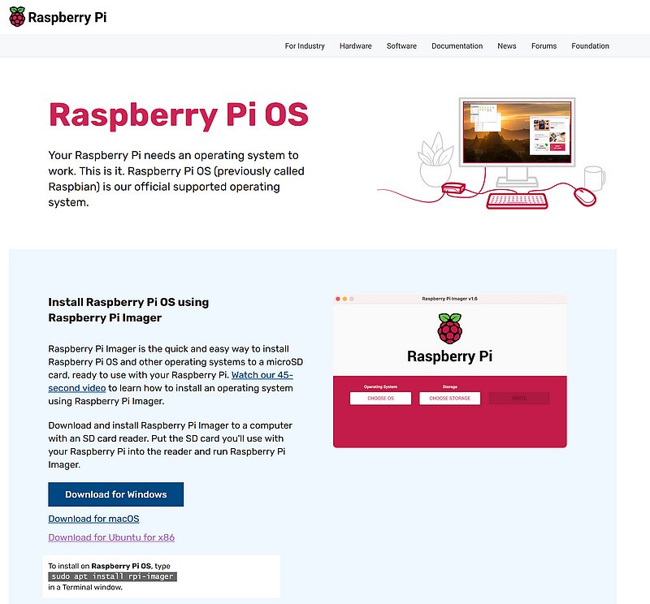

_Vous aboutissez sur cette page. Téléchargez la version qui correspond à votre système d’exploitation : Windows, Mac OS ou Ubuntu._

&nbsp;
***
&nbsp;
## Utilisation de Raspberry Pi Imager

&nbsp;

&nbsp;

_A l’ouverture, Raspberry Pi Imager affiche cette fenêtre.On peut (de gauche à droite)_
* Choisir l’OS qu’on souhaite installer
* Choisir la destination pour écrire (carte SD, SSD, clé USB…)
* Lancer l’écriture
&nbsp;

&nbsp;
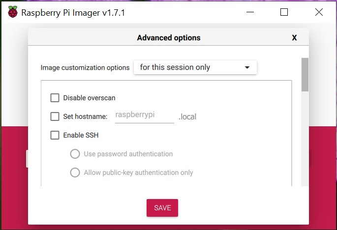

&nbsp;

_Un menu « caché » peut être activé en appuyant simultanément sur SHIFT + CTRL + X (sur Mac ce sera Command + SHIFT + X). Ces options avancées (**Advanced options**) s’appliquent par défaut pour la seule cession d’écriture en cours._
&nbsp;

&nbsp;
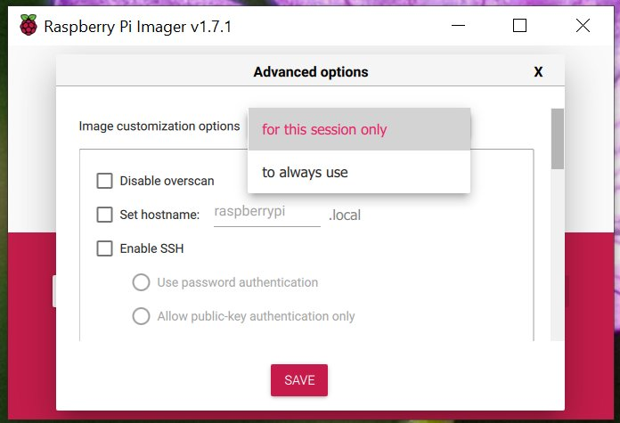

&nbsp;

_En choisissant **to always use**, ces options seront enregistrées et appliquées lors des prochaines créations de supports avec Raspberry Pi OS._

&nbsp;

&nbsp;
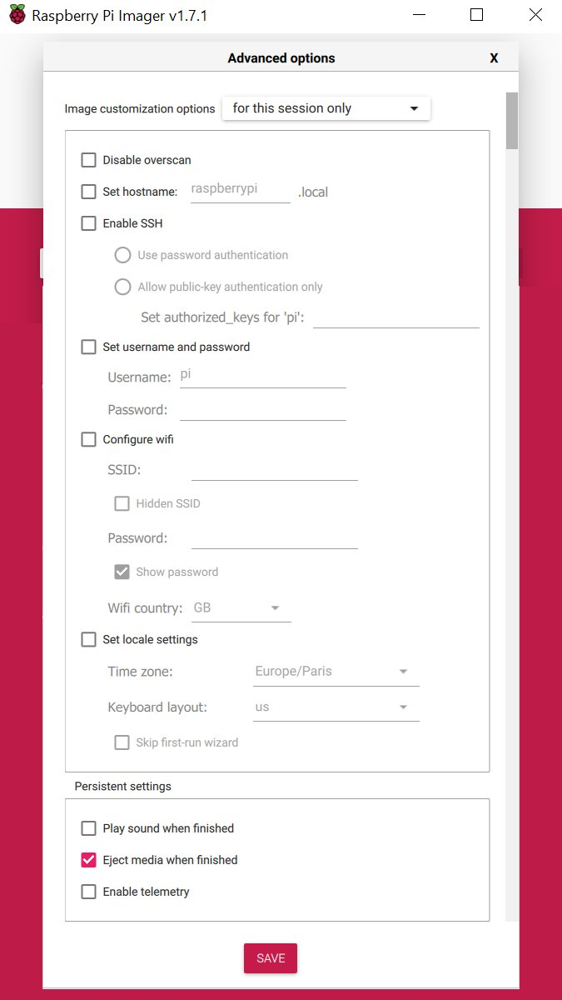
&nbsp;

_(**Activer le SSH pour contrôller raspberry pi  depuis votre ordinateur**)_   
_Je vous ai représenté ici la totalité du menu, vous trouverez un peu plus loin des explications plus détaillées._

&nbsp;

&nbsp;

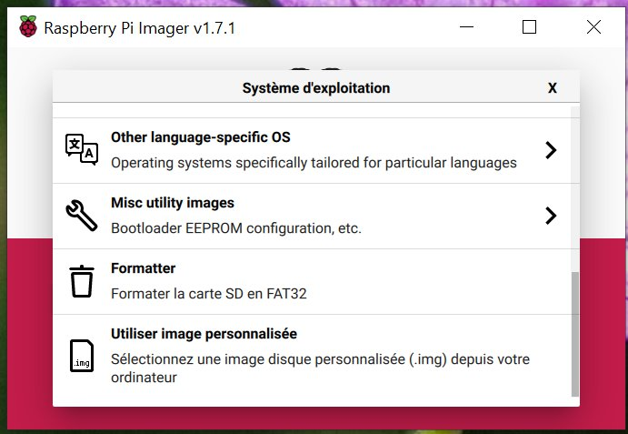

&nbsp;

_Vous choisirez le Système d’exploitation parmi toutes les distributions proposées. Il y a des OS classiques, mediacenter, retrogaming, domotique… A noter en bas de la liste un certain nombre d’options qui peuvent vous intéresser comme l’installation d’une image qui ne figure pas dans la liste et qui se trouve sur votre ordinateur._

###### Les options avancées

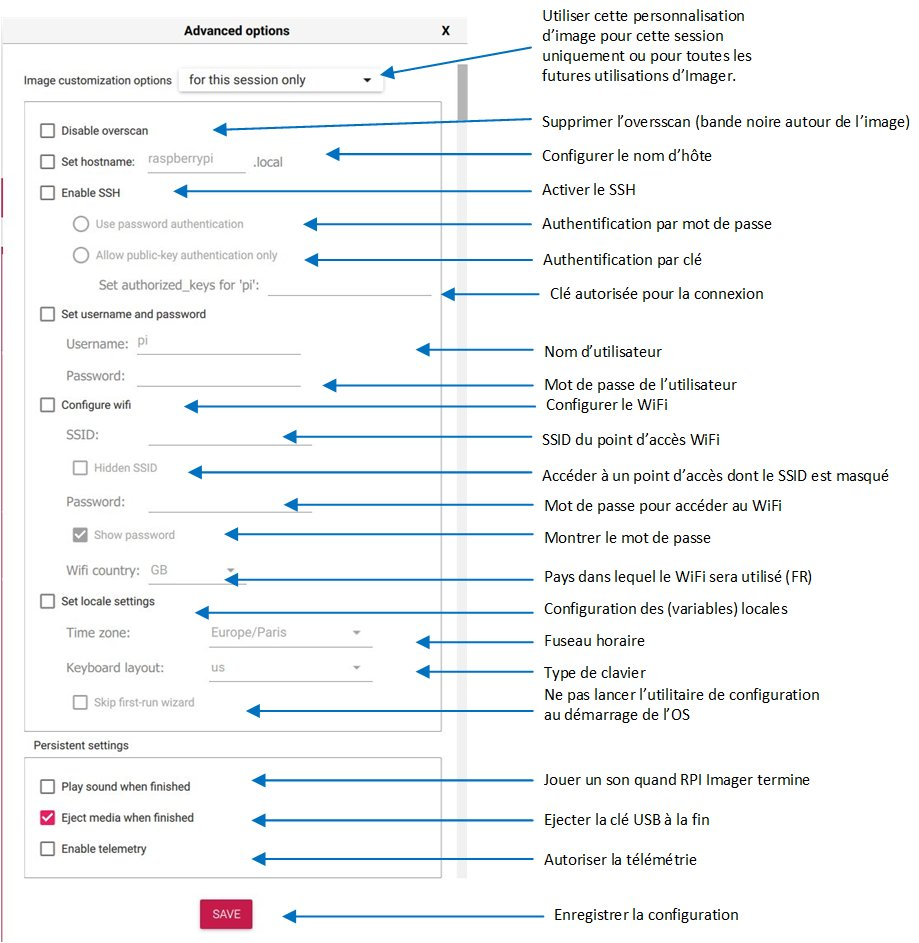

&nbsp;

_Ce visuel présente la totalité des options disponibles avec une explication pour chacune des options_

&nbsp;
***
&nbsp;

## Création d’une carte SD avec OS 64 bits

&nbsp;

 

&nbsp;

_On commence par cliquer sur le bouton **CHOISISSEZ L’OS**_

&nbsp;

 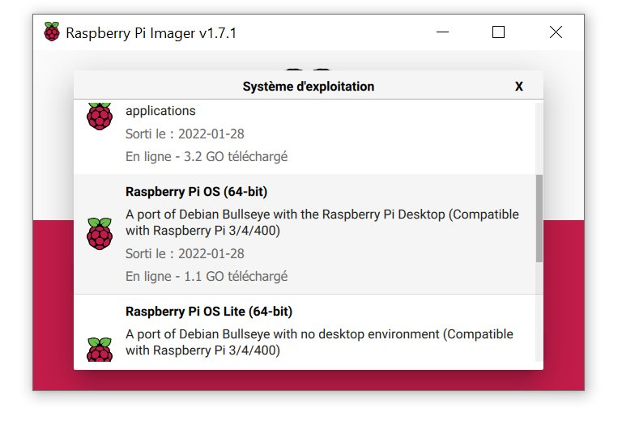

_Dans mon cas ce sera **Raspberry Pi OS (other)** > **Raspberry Pi OS (64-bits)**_

&nbsp;

 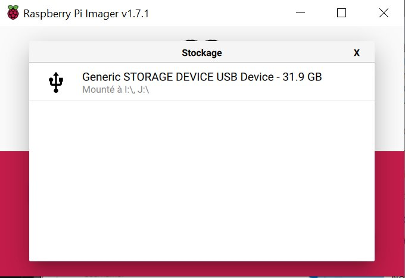

&nbsp;

_Choisissez ensuite la destination en cliquant sur **CHOISISSEZ LE STOCKAGE**. Ici c’est une carte micro SD de 32 Go_

&nbsp;

&nbsp;

 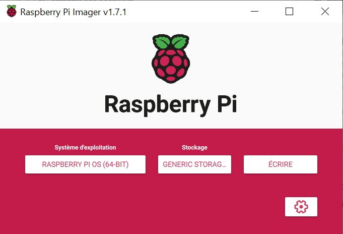

&nbsp;

_Quand vous avez choisi l’OS et la destination, le bouton **ÉCRIRE** est activé. Notez que **le menu avancé est aussi activé à ce moment**, c’est la roue dentée en bas à droite qui est apparue et vous permet de rentre dans la liste de configuration. Une fois que vous êtes prêt(e), cliquez sur le bouton **ÉCRIRE**._

&nbsp;

 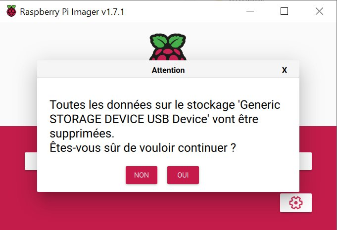

&nbsp;

_Raspberry Pi Imager vos avertit que les données présentes sur le support vont être effacée et donc perdues. Si vous êtes sûr(e) qu’il n’y a pas de données importantes sur le support, cliquez sur **OUI** pour continuer._

&nbsp;

 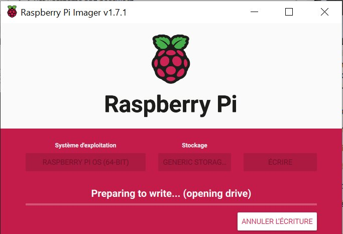

&nbsp;

_Raspberry Pi Imager accède au support pour commencer l’écriture._

&nbsp;

 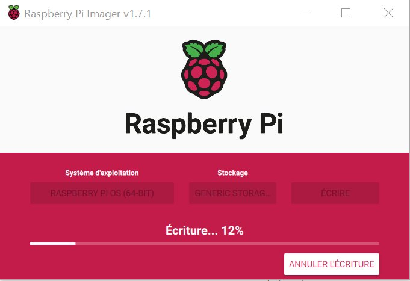

&nbsp;

_L’avancement de l’écriture est indiquée sur la barre de progression._

&nbsp;

 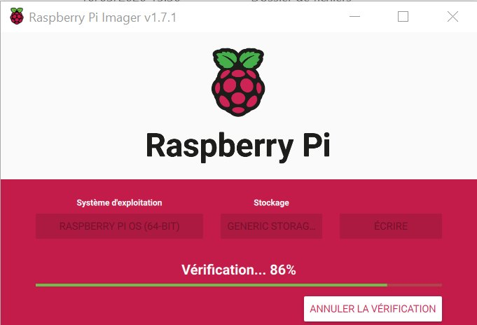
&nbsp;

_Quand l’écriture sur le support est terminée, Raspberry Pi Imager réalise une vérification pour confirmer que l’écriture s’est bien passée et qu’il n’y a pas de différence entre l’image de l’OS choisie et l’image réellement écrite sur le support._

&nbsp;

 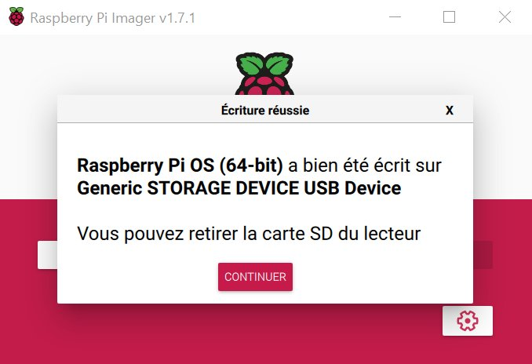

&nbsp;

_S’il n’y a pas d’erreur, cliquez sur le bouton CONTINUER puis enlever la carte SD et la glisser dans le Raspberry Pi._

&nbsp;
***
&nbsp;

