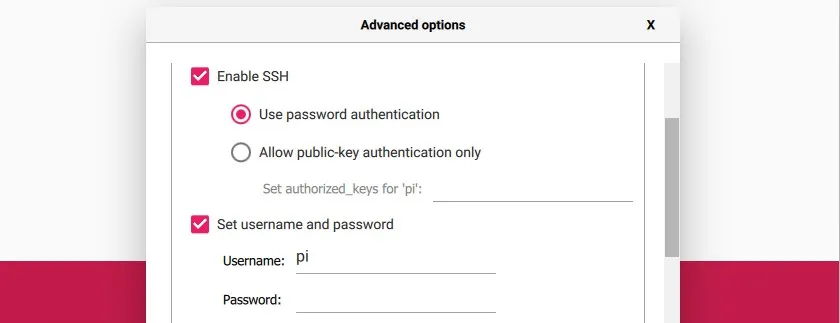
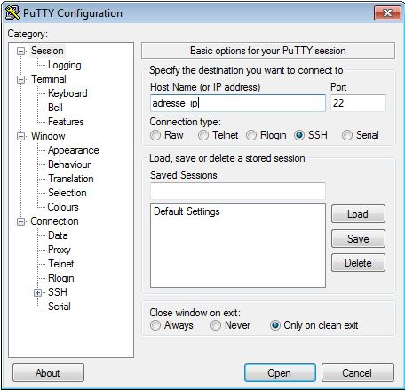
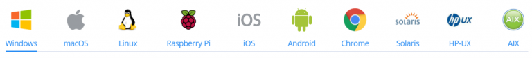
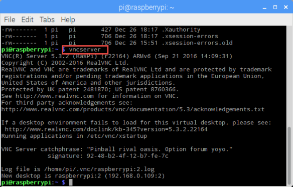
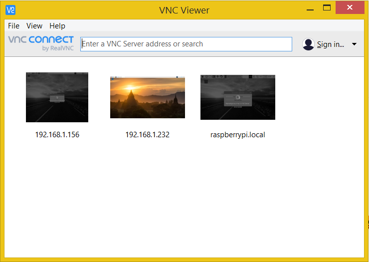
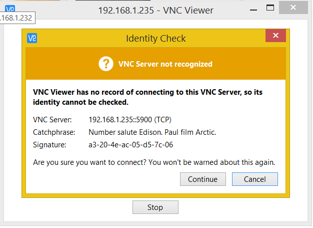
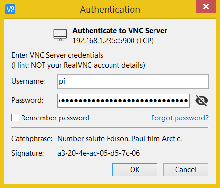
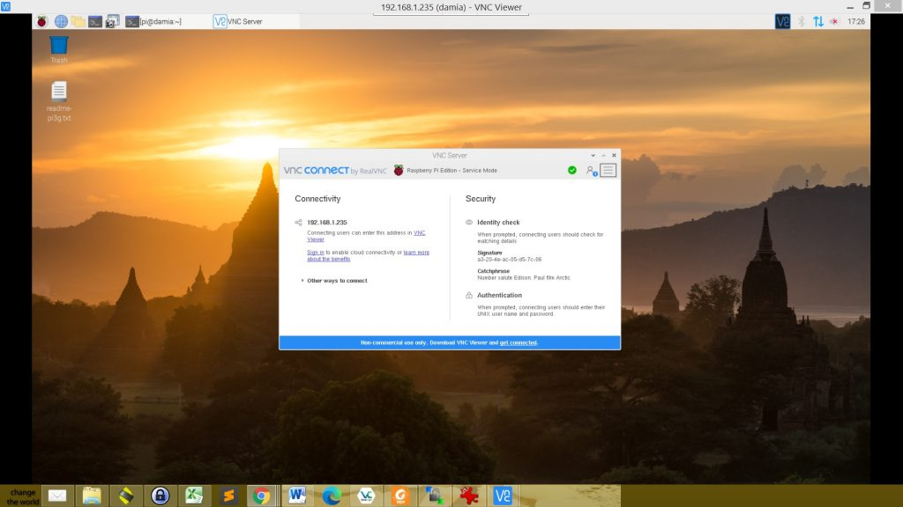

# Connectez vous en SSH à votre Raspberry Pi pour la contrôller depuis votre ordinateur

&nbsp;
***
&nbsp;

## SSH c’est quoi ?

Avant de voir comment contrôler la Raspberry Pi avec SSH, voyons exactement ce qu’est SSH.

SSH (pour Secure SHell) désigne à la fois **un logiciel et un protocole de communication informatiques**. Ce protocole possède par ailleurs la particularité **d’être entièrement chiffré**. Cela signifie donc que toutes les commandes que vous exécuterez via SSH seront totalement secrètes !

SSH a été créé en 1995 avec pour principal but de permettre la prise de contrôle à distance d’une machine à travers une interface en lignes de commande.

Aujourd’hui, **SSH est principalement utilisé à travers l’implémentation libre OpenSSH qui est présente dans la plupart des distributions Linux**.

&nbsp;
***
&nbsp;

## Comment fonctionne SSH ?

Nous ne rentrerons pas ici dans les détails cryptographiques et autres. Nous nous contenterons **de faire un rapide tour d’horizon afin que vous saisissiez un peu mieux comment utiliser SSH**.

De façon générale, SSH permet de **se connecter à distance sur une machine en utilisant un compte utilisateur de la dite machine**.

Pour cela, l’ordinateur qui doit se connecter à la machine distante va fournir à celle-ci **le nom de l’utilisateur à utiliser et son mot de passe**. Il est possible dans certains cas **d’utiliser un jeu de certificats sur l’ordinateur et la machine distante**, permettant ainsi d’obtenir une connexion sécurisée sans avoir à taper un mot de passe. Il s’agit là d’un cas d’utilisation plus poussé **que nous n’aborderons pas ici**.

Par défaut SSH propose uniquement une prise de contrôle **en lignes de commande**. Il est possible dans certains cas d’ajouter une interface graphique .

&nbsp;
***
&nbsp;

## Installer SSH pour prendre le contrôle de votre Raspberry Pi

Maintenant que nous en savons un peu plus sur SSH, **voyons comment le mettre en place pour contrôler votre Raspberry Pi !**

Tout d’abord, vous devez savoir que l’installation de SSH se découpe en deux parties. En effet, vous aurez besoin **d’un côté d’un serveur SSH sur votre Raspberry Pi et d’un autre d’un client SSH sur votre ordinateur**. Le premier recevra les commandes à lancer tandis que le second les enverra.

&nbsp;
***
&nbsp;

## Activer le serveur SSH sur votre Raspberry Pi

### Raspberry Pi Imager
Si vous installez Raspberry Pi OS en utilisant l’outil Raspberry Pi Imager, vous pourrez utiliser les options avancées pour l’activer :
* **Exécutez Raspberry Pi Imager** (si vous ne l’avez pas, vous pouvez [le télécharger à partir de là](https://www.raspberrypi.com/software/), le site est en anglais).
* **Choisissez n’importe quelle version de Raspberry Pi OS dans la liste des OS**.
* **Sélectionnez votre carte SD ou votre disque USB en cliquant sur le bouton du milieu**.
Vous devriez voir apparaître un bouton pour les paramètres avancés en bas à droite de la fenêtre. Cliquez dessus pour ouvrir ce formulaire :



Il peut également fonctionner avec d’autres distributions comme Ubuntu. Si le système n’est pas géré, le bouton ne s’affichera pas.
* **Cochez la case « Enable SSH » et choisissez un nom d’utilisateur et un mot de passe** (ceci est obligatoire pour des raisons de sécurité).
* **Une fois que c’est fait, fermez le popup et flashez votre système comme d’habitude. SSH sera activé au premier démarrage**.

### Manuellement
Si vous n’utilisez pas Raspberry Pi Imager, ou si vous voulez activer SSH sur une carte SD que vous avez flashée précédemment, vous pourrez également le faire manuellement :
* **Insérez votre carte SD dans votre ordinateur**.
* **Ouvrez le dossier correspondant dans l’explorateur de fichiers (généralement nommé « boot »)**.
* **Créez un nouveau fichier dans celui-ci, nommé « ssh » sans extension**.
Si vous êtes sous Windows, assurez-vous qu’il ne crée pas « ssh.txt » ou quelque chose de ce genre. Vous devrez activer l’affichage des extensions dans les paramètres de votre explorateur.
* **Retirez la carte SD, et SSH sera activé au prochain démarrage**.

&nbsp;
***
&nbsp;

## Installer le client SSH sur votre ordinateur

Cette fois, pas de bonne nouvelle, à priori vous n’avez pas de client SSH installé chez vous. Il y a donc deux possibilités, **soit vous avez un ordinateur sous Windows** (et nous nous demandons bien pourquoi :b), **soit vous avez un ordinateur sous Linux** (et les femmes – ou les hommes d’ailleurs – se jettent à vos pieds, vos ennemis vous craignent et vos amis vous envient).

**Nous allons donc voir l’installation d’un client SSH pour les deux cas**.

### Installer un client SSH sur Linux

Si vous êtes sous Linux, vous le savez déjà, le monde est plus beau ! **Pour installer un client SSH, rien de plus simple**, il vous suffit de lancer la commande suivante :

```bash
sudo apt-get update && sudo apt-get install openssh-client
```
Vous voyez, tout est plus simple sous Linux (oui, nous sommes de mauvaise foi) !

### Installer un client SSH pour Windows

Vous avez fait le mauvais choix mais il vous sera beaucoup pardonner (enfin peut-être)…

**Vous allez devoir installer le logiciel Putty qui est un client SSH et TelNet**. Vous pourrez trouver cet excellent outil [sur le site dédié](https://www.putty.org/).

Point intéressant, Putty fait partie de ces logiciels qui ne nécessitent pas d’installation !

&nbsp;
***
&nbsp;

## Utiliser SSH pour vous connecter à la Raspberry Pi

Maintenant que nous avons installé un serveur et un client SSH, **il ne nous reste plus qu’à les utiliser**.

Là encore, deux méthodes différentes **selon que vous soyez sous Linux ou sous Windows** .

Dans le fond, le principe reste néanmoins le même, **utilisez le client SSH pour communiquer avec le serveur, ceci à l’aide de l’adresse du serveur, d’un nom utilisateur et du mot de passe associé**.

### Utilisez SSH avec Linux (ou Mac OS X)

Comme toujours avec Linux, **il vous suffit d’une seule ligne de commande pour vous connecter à la Raspberry Pi**.
```bash
ssh utilisateur@adresse_ip_ou_url_serveur
```
**Bien entendu, vous devrez remplacer « utilisateur » par le nom de l’utilisateur avec lequel vous souhaitez vous connecter et « adresse_ip_ou_url_serveur » par l’IP du serveur ou son adresse URL si il en possède une**.

par défaut :
```bash
ssh pip@raspberrypi.local
```

Une fois que vous aurez rentré le mot de passe du compte utilisateur (lequel, pour des questions de sécurité, ne s’affiche pas quand vous le tapez), **vous serez connecté au terminal de la Raspberry Pi et toutes les commandes tapées seront faites sur la Raspberry Pi !** Pour quitter SSH il vous suffit d’utiliser la commande « exit ».

Si vous utilisez un Mac, c’est la même chose, ouvrez votre terminal et utilisez les mêmes commandes. Un client SSH est normalement installé par défaut.

### Utilisez SSH avec Windows et Putty

Pour Windows, comme souvent, **il va falloir passer par l’interface graphique**. Vous allez donc devoir **lancer Putty et remplir les informations comme sur l’image ci-dessous**.


**Là aussi, remplacer « adresse_ip » par l’adresse IP ou l’URL du serveur**. Pour information, le numéro du port (22) est le port par défaut de SSH.

Une fois ceci fait, cliquez sur le bouton « Open ». Une fenêtre de console devrait s’ouvrir en vous demandant le nom d’utilisateur que vous souhaitez utiliser puis son mot de passe. **Une fois ceci fait, vous serez connecté à la Raspberry Pi**, comme sous Linux il vous suffit de taper « exit » pour quitter la connexion.

Sachez qu’il est possible d’enregistrer des configurations SSH avec Putty. Si vous souhaitez employer cette fonction, **nous ne pouvons que vous conseiller de ne pas enregistrer le mot de passe, ceci étant véritablement une mauvaise pratique en terme de sécurité !**.

&nbsp;
***
&nbsp;

## Ajouter une interface graphique

### Téléchargez et installez le visualiseur RealVNC

**Les étapes suivantes sont exécutées sur votre système principal, à partir duquel vous souhaitez contrôler le Raspberry Pi à distance en utilisant VNC**.

[Téléchargez le visualiseur VNC à partir du site Web de RealVNC](https://www.realvnc.com/en/connect/download/viewer/). Veillez à sélectionner le système d'exploitation approprié (Windows / macOS / Linux / Raspberry Pi / iOS / Android / Chrome / Solaris / HP-UX / AIX).



Téléchargez le visualiseur VNC à partir du site Web de RealVNC.

### Ovrir une canal vncserver depuis votre raspberrypi

Utilisez le code suivant pour ouvrire une canal :

```bash
vncserver
```

Cela va générer une canal pour l'utilisée sur VNC Viewer.



 Maintenant, copier le canal généré (dans mon cas c'est raspberrypi:2 ou 192.168.0.109:2).

### Lancez VNC Viewer



Ici, vous pouvez entrer l'adresse géneré de l'étape précedente. Tapez l'adresse, et cliquez sur la zone "connecter à l'adresse ou au nom d'hôte" (ou appuyez simplement sur la touche Entrée) :



Vous reconnaîtrez ici l'autre partie de la fenêtre d'information du serveur VNS sur votre Raspberry Pi. Cliquez sur Continuer, si les informations correspondent (Catchphrase et Signature).

### Authentifiez-vous avec votre Raspberry Pi

Maintenant, le VNC Viewer vous montrera un écran d'authentification, vous demandant de vous connecter avec vos informations d'identification (mot de passe et nom d'utilisateur).

**Ce sont les informations d'identification que vous utilisez sur votre Raspberry Pi, très probablement pour l'utilisateur "pi". (Si vous n'avez pas modifié l'identifiant mots de passe par défaut pour les Raspberry PiVous devez maintenant le faire, car tout le monde sur votre réseau peut accéder à votre Raspberry Pi en utilisant VNC !)**



Il y a une option "Mémoriser le mot de passe" ici. Si vous n'avez besoin de vous connecter à votre Raspberry Pi que de manière sporadique, je vous recommande de ne pas l'activer, sinon toute personne ayant accès à votre ordinateur principal pourra également accéder au Pi.

Cliquez sur OK, et ...



&nbsp;
***
&nbsp;

## Conclusion

Voilà, **vous savez maintenant comment contrôler votre Raspberry Pi à distance avec SSH !**

&nbsp;
***
&nbsp;
